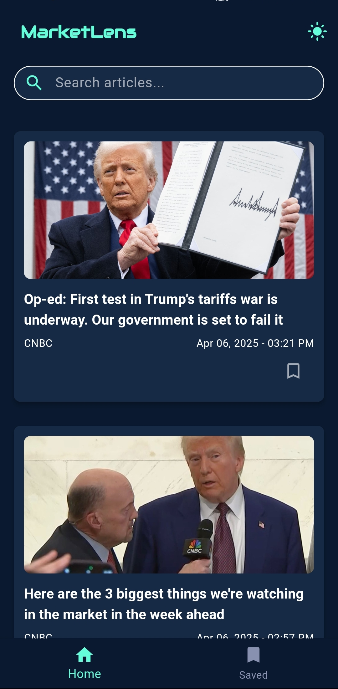
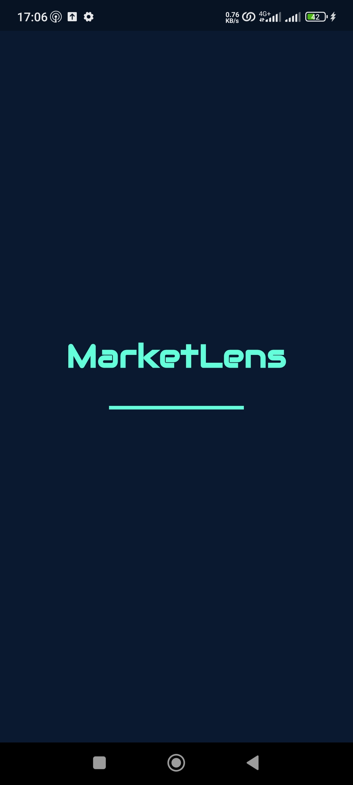

# MarketLens 📈




**MarketLens** is a sleek Flutter-powered financial news aggregator that delivers real-time market updates with personalized article saving capabilities.

---

## ✨ Features

- 📡 **Real-time Market News** – Latest financial headlines from trusted sources
- 🔖 **Personalized Feed** – Save articles to read later
- 🌙 **Dark/Light Mode** – Eye-friendly theme switching
- 🔍 **Intuitive Search** – Find articles by keyword, source, or date
- 📱 **Responsive Design** – Optimized for all Android screen sizes
- 📴 **Offline Access** – Saved articles available without internet

---

## 🛠️ Tech Stack


- **Frontend**: Flutter 3.x
- **State Management**: Provider
- **API**: [Finnhub Market News](https://finnhub.io/)
- **Local Storage**: SharedPreferences
- **Networking**: Dio

---

## 🚀 Installation

### 1. Clone the Repository

```bash
git clone https://github.com/The-Byte-Bandit/MarketLens.git
cd MarketLens
```
